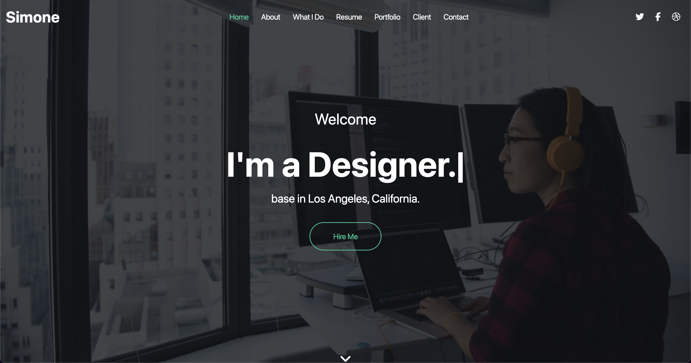
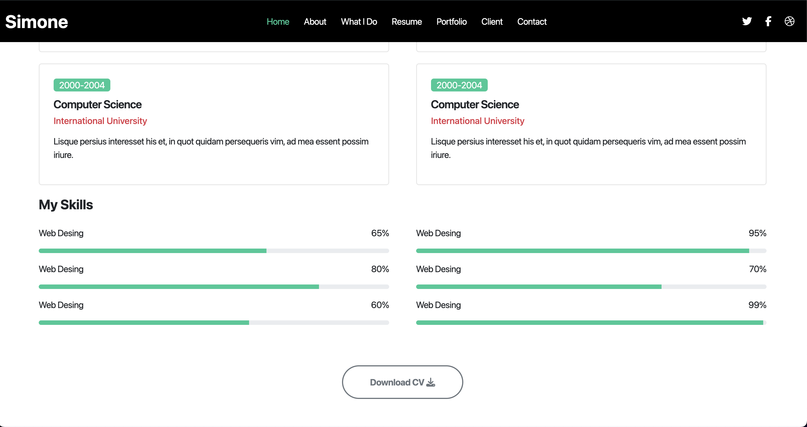

# Simone Landing Page

)
)
)

## Project Description
The Simone Landing Page is a responsive web design practice project built to enhance skills in HTML, CSS, and Bootstrap. The goal of the project was to create a modern, mobile-friendly layout that adapts seamlessly to different screen sizes, ensuring a smooth user experience on both desktop and mobile devices.

## Usage
You can view the landing page by opening the `index.html` file in your browser.

Alternatively, you can visit the live demo:
[Live Demo](https://ayman17.github.io/Simone-Landing-Page/)

### Features
- Fully responsive design for various screen sizes
- Hero section with call-to-action
- Bootstrap-based layout for faster and cleaner design
- Simulated business section showcasing services

## Screenshots

## Learning Outcomes
This project helped me practice:
- Bootstrap's grid system for adaptive layouts
- Ensuring cross-browser compatibility
- Using FontAwesome icons to enhance the visual appeal
